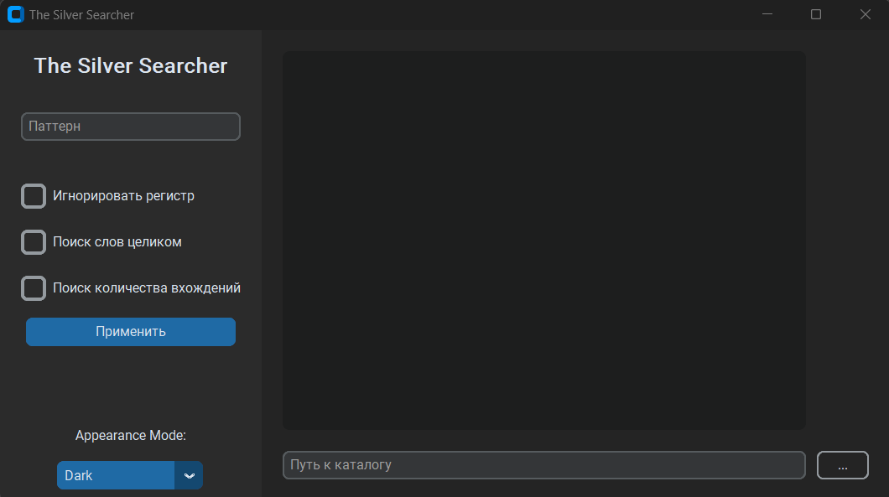
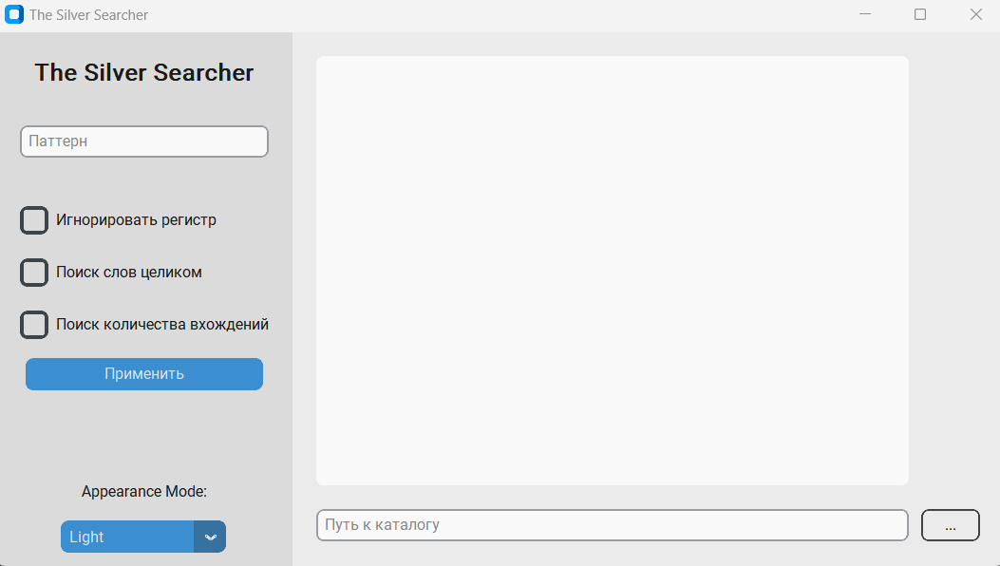

# The Silver Searcher Interface

## Description

This project is a Python graphical interface using the <a href="https://github.com/TomSchimansky/CustomTkinter">
CustomTKinter</a> and <a href="https://docs.python.org/3/library/tk">Tkinter</a> libraries for convenient interaction 
with "The Silver Searcher" (Ag) tool.

This interface allows users to perform searches for text patterns in files and configure various parameters for more 
precise and user-friendly searches.

## Dark Theme

## Light Theme

# Requirements

- [Python v3.10.2](https://docs.python.org/3.10/)
- [TKinter](https://docs.python.org/3/library/tk)
- [CustomTKinter v5.2.1](https://github.com/TomSchimansky/CustomTkinter)
- [Packaging v23.2](https://pypi.org/project/packaging/)

